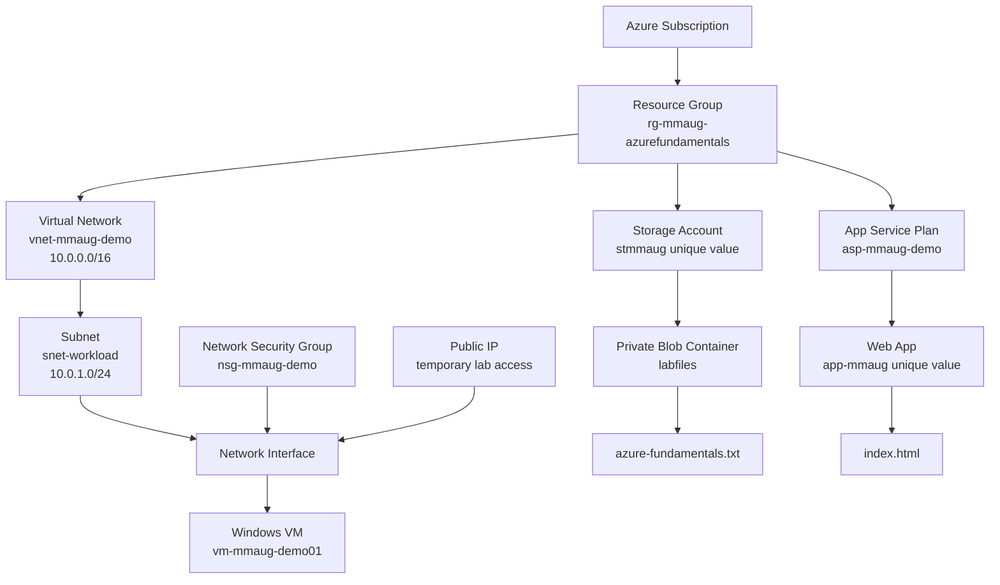

# Lab Architecture

The resource group holds resources that share one lab lifecycle. The VNet address space is `10.0.0.0/16`; the subnet uses the smaller `10.0.1.0/24` range. The NSG filters traffic. The Storage account and App Service are separate services in the same resource group.

